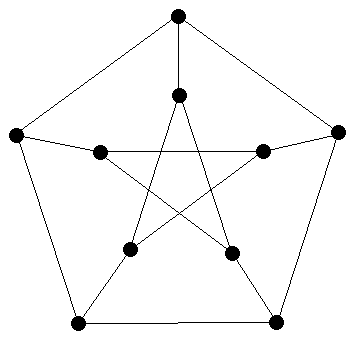
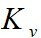
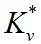
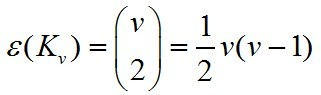
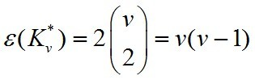

## 图的同构

### 基本概念

 * __图的恒等(identical)__: 设D = (V(D),E(D),ψD).和 H = (V(H),E(H),ψH) 是两个图.如果V(D) = V(H), E(D) = E(H) 且 ψ(D) = ψ(H), 则称D和H是__恒等的(identical)__. 记为 D = H.
 * __同构(isomorphic)__: 对于两个图 G=(V(G),E(G)) 与 H=(V(H),E(H)),如果存在两个一一映射: `α:V(D)→V(H) 和 β:E(G)→E(H)` 使得对任意 e=(u,v)∈ E(G), 都有(α(u),α(v))∈E(H) 且 β(e)=(α(u),α(v)), 则称图 G 与 H 同构。记为G≌H 。
 * __同构映射(isomorphic mapping)__: 同构条件中的α:V(D)→V(H) 和 β:E(G)→E(H)称为__同构映射__.
 * __标号图(labeled graph)__: 顶点已确定标号的图称为标号图.

### 符号:
 * __图的恒等__: `D = H` 表示 图D与图H是恒等的.
 * __同构__: `D≌H` 表示 图D与图H是同构的.
 * 

### 图:
 * Petersen图:
   
 * __完全图(complete graph)__: 任何不同两顶点之间都有边相连的简单无向图称为__完全图(complete graph)__.
 * __完全有向图(complete digraph)__: 完全图的对称有向图.

### 笔记:
 1. 要证明两个图是同构的,必须指出他们的同构映射.
 1. 图的同构关系是一种等价关系. 等价关系将同阶图分为若干个等价类, 同构的两个图属于同一类.
 1. 同构的图具有相同的图形表示(相同的结构), 差别仅在于顶点和边的名字不同.
 1. 在同构的意义下, _v阶完全图_与_v阶完全对称有向图_都是唯一的. 记为:  和 .
 1. K3 是 三角形(triangle).
 1. _v阶完全图_的边数为: 
 1. _v阶完全对称有向图_的边数为: 
