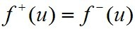
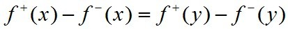

## 网络流

 [shonenada](http://shonenada.com) @ 2013/6/16
 
### 基本概念
 * __网络(network)__: 网络是指具有两个不同的特定顶点x和y的加权连通图(D,ω), 记为 N = (Dxy, ω)
  * x 称为 __发点(source)__
  * y 称为 __收点(sink)__
 * 若 ω 为非负的_容量函数(capacity function)_ c, 则称网络 N = (Dxy, c) 为__容量网络(capacity network)__.
  * c 在边a上的值c(a)称为边a的__容量(capacity)__.
 * __整容量网络(integer capacity network)__: 对于所有 a∈Ε(D), c(a) 都是非负整数,则称N为__整容量网络(integer capacity network)__.
 * __流(flow)__: 若存在`f∈E(D)`使得 `0 ≤ f(a) ≤ c(a)`, 对所有`a∈Ε(G)`并且, 对所有`u∈V(G)\\{x,y}`则称f是N中从x到y的流, 简记(x,y)流。a 边上的值为f(a).
 * 对容量网络中的任何(x,y)流均有: . 等式两边的值称为(x,y)流f的__流量(value of a flow)__.
  * __最大流(maximum flow)__: N中具有最大流量的(x,y)流称为__最大流__.
 * __截边集(cut edge set)__: D 中形如(S,\\S)有向边集B称为(x,y)__截边集(cut edge set)__, 其中 `x∈S, y∈\\S`.
 * __B的容量__: `capB = c(B) = ∑(a∈B){c(a)}.
  * __最小截边集(minimum cut set)__: 具有最小容量的(x,y)截边集称为__最小截边集__.

### 符号
 * __网络__: N = (Dxy, ω).
 * __Ε(D)__: D的边空间.

### 笔记
 * 容量是网络上能通过的流的最大限度,所以有 `0 ≤ f(a) ≤ c(a)`.
 * 对于任何从x到y的流f, f上除x与y点外的其他任何点, 入度 = 出度. 联系到《电路》的知识,电流上的任何一点, 入电流 = 出电流, 所以有电路上的任何一点不可能有电流停留.
 * 对于(x,y)截边集, 去掉(x,y)的截边集后,图上不存在x到y的路.
 * 对于最大流最小截定理的理解,需要注意边a的流量f(a) 需要满足__入流=出流__.因此不一定能取边容量为流量.