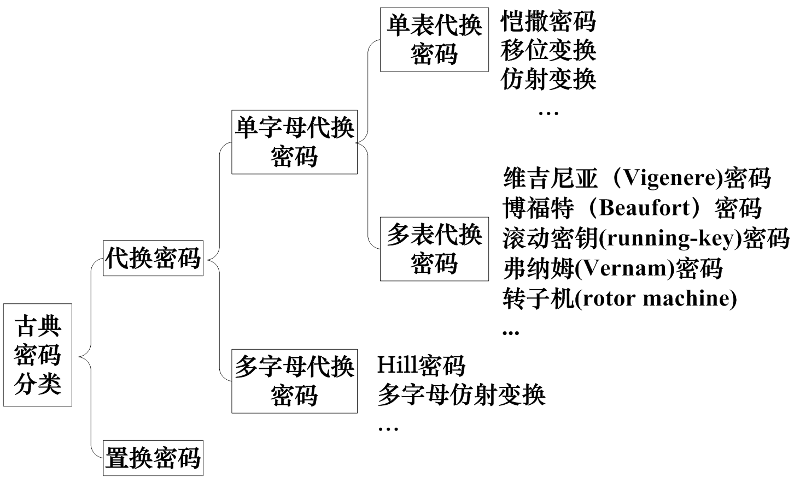
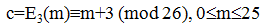
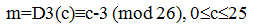
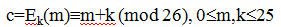
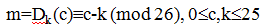
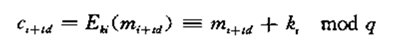

## 古典密码

### 基本概念

 * 密码学（Cryptology）：研究信息系统安全保密的学科
 * 密码编码学（Cryptography）： 研究对信息进行编码，实现信息的隐藏。
 * 密码分析学（Cryptanalysis）： 研究加密消息的破译或伪造
 * 基尔霍夫原则：
   1. 系统的保密性不依赖于对加密体制或算法的保密，仅仅依赖于密钥。
   2. 对称密码体制（私钥密码体制）：加密密钥于解密密钥相同。
   3. 非对称密码体制（公钥密码体制）：加密密钥与解密密钥不同，加密密钥可以公开（公钥）；解密密钥保密（密钥）。

### 对称密码

 * 加密： __信息（明文）P__ 与 __密钥K__ 作为加密算法的输入，而输出为 __密文 C__ .
 * 解密： __密文 C__ 与 __密钥K__ 作为解密算法的输入，而输出为 __信息（明文）P__ .
 * 明文P：需要秘密传送的消息。
 * 密钥K：加密和解密时使用的一组秘密信息。
 * 密文C：明文经过密码变换之后的消息。
 * 加密算法E：对明文进行加密时采用的一组规则。 _C = E(P, K)_
 * 解密算法D：对密文进行解密时采用的一组规则。 _P = D(C, K)_
 * 密钥产生算法GEN：概率多项式时间算法，输出密钥。
 * 密码系统数学符号： __S = {P, E, K, C, D}__
 * 强安全的加密算法：使敌手已知加密算法与多个密文（或多个明密文对），不能解密密文并恢复出秘钥。
 * 公开算法的优点：
   1. 构造好的密码算法十分困难，因此高安全的密码算法应该得到公众的检验。
   2. 公开缺陷好过局部已知缺陷。
   3. 算法是工程实现的一部分，易泄露。
   4. 算法公开有利于标准的建立。
   5. 秘钥保密比算法保密更有利于工程实现、存储与使用。

### 密码分析

 * 攻击者最终目标是 __密钥__ . (获知密钥可以获得所有密文对应的明文)
 * 两种攻击方法：
   1. 密码分析攻击：利用算法的特征和明文的一般特征，推导出特别的明文，或者使用的密钥。（频度分析法）
   2. 穷尽攻击（暴力攻击）
 * 攻击类型：
   1. 唯密文攻击。已知信息：加密算法、密文
   2. 已知明文攻击。已知信息：加密算法、密文、用同一密钥加密的一个或多个明密文对。
   3. 选择明文攻击。已知信息：加密算法、密文、分析者任意选择的明文，用同一密钥加密的密文
   4. 选择密文攻击。已知信息：加密算法、密文、分析者有目的选择一些密文，用同一密钥解密的对应明文
   5. 选择文本攻击。已知信息：加密算法、密文、分析者有目的选择一些密文，用同一密钥解密的对应明文
 * 无条件安全：无论花多少时间，多少已知信息，都不能唯一确定密文所对应的明文。
 * 计算安全：
   1. 破译密码的代价超出密文的价值
   2. 破译密码的时间超出密文的有效生命期

### 古典密码：

 * 古典密码分类：

 

#### 代换技术

 * 凯撒（Caesar）密码：
   * 加密：
   * 解密：
 * 移位密码：
   * 加密：
   * 解密：
 * 维吉尼亚密码（多表代换）：由 d 个字母序列给定密钥 k = (k1, k2, k3..kd), ki 确定明文第 i + td 个字母（t为正整数）的移位次数。
 * 置换密码(Transposition Cipers)：通过置换形成新的字母序列，仅仅是改变明文中字母的顺序，并不改变字母出现的次数。
 * 栅栏密码(Rail Fence Ciphers)：对角线的顺序写入明文，行的顺序读出作为密码。
 * 行置换密码(Row Transposition Ciphers)：把消息一行行地写成矩形块，按列读出，但把列的次序打乱，列的次序就是密钥。