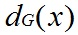
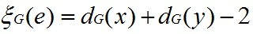
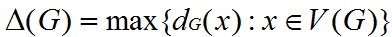
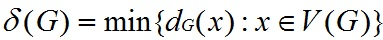
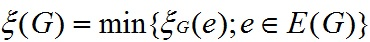
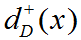
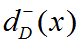
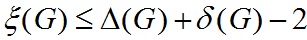

## 图的顶点度与运算

### 基本概念
 * __顶点度(vertex degree)__: x∈V(D), 与x关联边的数目(一条环计算两次),记为.
 * __d度点(a vertex of degree d)__: 顶点度为d 的顶点,称为d度点.
 * __孤立点(isolated vertex)__: 零度点称为孤立点.
 * __k正则(k-regular)__: 若对每个x∈V(G), dG(x) = k, 则G是正则的.
 * __边的度(degree of edge)__: e = (x,y), 则 e 的度 = x的度 + y的度 - 2. (2表示 x,y 之间的度). 符号: 
 * __最小边度(minimum edge-degree)__: 图G中最小的边的度.
 * __边正则的(edge-regular)__: 如果 G中每条边e都有ζ(e)=ζ(G), 则 G 为__边正则的(edge-regular)__.
 * __顶点出度(vertex out-degree)__: 对于有向图D, x的顶点出度即D中以x为起点的有向边的数目.
 * __顶点入度(vertex in-degree)__: 对于有向图D, y的顶点出度即D中以y为终点的有向边的数目.
 * __顶点度(vertex-degree)__: 顶点度 = 顶点入度 + 顶点出度.
 * __平衡点(balaned vertex)__: 若 x 的顶点入度 = 顶点出度, 则x称为平衡点.
 * __平衡有向图(balanced digraph)__: 每个顶点都为平衡点的有向图.
 * __最大顶点入度__: 略.
 * __最大顶点出度__: 略.
 * __最小顶点入度__: 略.
 * __最小顶点出度__: 略.
 * __正则有向图(k-regular digraph)__: 最大/小顶点入/出度 (四个) 都等于 k 的有向图.

### 符号:
 * : 顶点度
 * : 最大顶点度
 * : 最小顶点度
 * : 边的度.
 * : 最小边度
 * : 顶点出度
 * : 顶点入度

### 笔记:
 1. 正则图 => 边正则的. 但 边正则 !=> 正则图.
  * 正则图是图的__点__的度相同, 而边正则则是__边__的度相同,且等于G的最小边度.
 1. k正则有向图, 实际上就是所有点的出入度都相等,且为k的有向图.
 1. 由定义得: 
  * 证明:
   1. 令 x 是G中的最小度点,则有: _dG(x) =δ(G)_.
   1. ζ(G) ≤ ζ(x, y) = dG(x) + dG(y) - 2 = δ(G) + dG(y) - 2.
   1. ∵ △(G) ≥ dG(v), v∈V(G), ∴△(G) ≥ dG(y).
   1. ζ(G) ≤ ζ(x, y) = dG(x) + dG(y) - 2 = δ(G) + dG(y) - 2 ≤ δ(G) + △(G) - 2 
 1. 