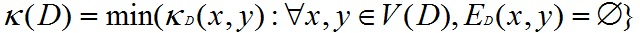
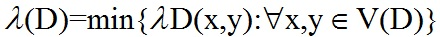

## 连通度

 [shonenada](http://shonenada.com) @ 2013/6/18
 
### 基本概念
 1. __分离集(separating set)__: 设D是强连通图,非空集 S 包含于 V(D). 若 D-S 是非强连通的,则称 S是D的__分离集(separating set)__.
  * 显然, 若D不含支撑子图,则D必有分离集. -> 若 D中不含支撑子图,则D的直径d(D)≥2.令x,y∈V(D)使dD(x,y) = d(D).于是, V(D)\\{x,y} 就是D的分离集.
 1. __强连通度(strong connectivity)__: 见_符号#1_.
 1. __k强连通图__: 若κ(D) ≥ k, 则 D为__k强连通图__.
 1. __k分离集__: 点数为 k=κ(D) 的分离集称为__k分离集__.
  * 当D不含 v阶完全有向图时: 
 1. __截边集(cut-edge set)__: 设D是强连通图,非空集B包含于E(D).若D-B是非强连通的,则称 B为__截边集(cut-edge set)__.
  * 非平凡强连通图必含截边集.
  * 对于强连通图,割边集必含截边集,但截边集不一定是割边集.
  * 对于连通的无向图G,两个概念是一致的.
 1. __强边连通度(strong edge-conncetivity)__: 见_符号#2_.
 1. __k强边连通图__: 若λ(D) ≥ k, 则称D为k强边连通图.
 1. __λ截边集__: 边数为λ=λ(D)的截边集称为__λ截边集__.
  * 有: 
 1. 设G为无向图,D为对称有向图,有:
  1. S是G的分离集 等价于 S是D的分离集.
  1. B=(S,\\S)是G的截边集 等价于 (S,\\S)是D的截边集
  1. κ(D) =κ(G) 
  1. λ(D) =λ(G)

### 符号
 1. __强连通度(strong connectivity)__: 定义κ(D) 为 :
  1. 若D是非强连通的 则κ(D) = 0;
  1. 若D含支持子图Kv* 则κ(D) = v-1;
  1. 其他情形,κ(D) = min{|S|: S是D的分离集}.
 1. __强边连通度(string edge-connectivity)__: 定义λ(D):
  1. 若D的阶是1或者非强连通的, 则 λ(D) = 0;
  1. 其他情形: λ(D) = min{|B|: B是D的截边集}.

### 笔记
 1. 局部连通度是(x,y)的连通度. 而整体连通度是针对整个图的连通度. 分离集也同理.
 1. 