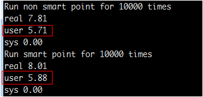
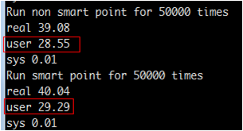
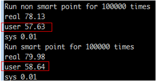
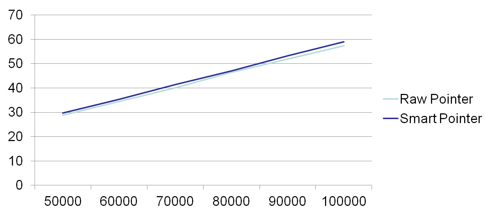
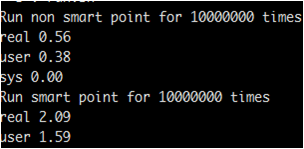
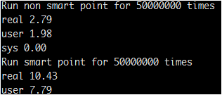
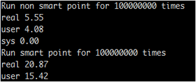

#Smart Pointer

Written by [shonenada.](http://shonenada.com)

Introduce to Smart Pointer
--------------------------
_In computer science, a smart pointer is an abstract data type that simulate a pointer while providing additonal features._  -- [WikiPedia](http://en.wikipedia.org/wiki/Smart_pointer)

In the C++ language, **smart pointer** implements as a template class and override the behaviour of raw pointer, such as dereferencing and assignment. What's more, smart poiner also providing addtional memory managment algorithms.

From the information above, we learn that:

 1. Smart pointer is a decorator of raw pointer. So smart pointer has more functions/methods than raw pointer, and use more convenient than raw pointer.
 1. Smart poiner is as well a template class, so it has the same usage of template class. For example: `shared_ptr<int> int_ptr`.

#### Two kind of smart pointers

 1. With **shared pointer** there could be multiple instance of the smart pointer pointing to the same object. It use some form of reference counting to manage the lifetime of the object they point to.

 1. With **unique pointer**, it has the restriction of only one instance of the smart pointer managing the object.

Difference between STL and Boost
--------------------------------
Here are some saying from wiki and stackoverflow:

 * std::shared_ptr is the C++0x form of tr1::shared_ptr, and boost's boost::shared_ptr should behave the same. -- wikiepedia
 * According to the Wikipedia C++0x page:The TR1 implementation lacked certain pointer features such as aliasing and pointer arithmetic, but the C++0x version will add these. -- wikiepedia
 * Now, C++11 provides?std::unique_ptr, as well as improvements to?std::shared_ptr?and?std::weak_ptr?from TR1.?std::auto_ptr?is deprecated. -- stackoverflow

In general, there is little difference between std and boost on smart pointer operations.

Performance on smart pointers
-----------------------------

Define a class with a double variable, and just do one thing: variable num multiply itself 10,000 times.

    class MyClass
    {
    public:
        MyClass(double input);
        ~MyClass();
    private:
        double num;
    };

    MyClass::MyClass(double input){
        num = input;
        for (int i=0;i<10000;++i){
            num = num * num;
        }
    }

The main function of *raw pointer*:

    int main (int argc, char *argv[]){
        int input = 1000;
       
        if (argc > 1){
            input = atoi(argv[1]);
        }
    
        for (int i=0;i<input;++i){
            MyClass *obj = new MyClass(2.0);
        }
     
        return 1;
    }

The main function of *smart pointer*:

    int main (int argc, char *argv[]){
        int input = 1000;
       
        if (argc > 1){
            input = atoi(argv[1]);
        }
    
        for (int i=0;i<input;++i){
            shared_ptr<MyClass> obj(new MyClass(2.0));
        }
     
        return 1;
    }

Then let *input* to be 10,000:

Let *input* to be 50,000

Let *input* to be 100,000

Here is the graph of performance:

#### Conclusion
From the experienments has done, we come to the conclusion that smart pointer's performance is closed to raw pointer when using in the normal way.

#### Additional experiment
In order to get more details of smart pointer's performace, here is another experiment, just allocation but not calculate:

A new class:

    Class MyClass{
    public:
        MyClass(double input);
        ~MyClass();
        void print();
    private:
        double num;
    };
    MyClass::MyClass(double input){
        num = 2;
        for (int i=0;i<input;i++){
            num = num * num;
        }
    }
    MyClass::~MyClass(){ }
    void MyClass::print(){
        cout << num << " ";
    }

The main function of smart pointer:

    int main(int argc, char *argv[]){
        int input = 1;
        if (argc > 1){
            input = atoi(argv[1]);
        }

        shared_ptr<MyClass> obj(new MyClass(input));
        
        return 1;
     }

The main function of raw pointer:

    int main(int argc, char *argv[]){
        int input = 1;
        
        if (argc > 1){
            input = atoi(argv[1]);
        }

        MyClass* obj = new MyClass(input);
        delete obj;

        return 1;
    }

And the result:

**Conclusion: Compared to raw pointer, smart pointer spends more time on allocating.**

Usage
-----

First of all, `#include <memory>`

 * One of constructors:

        template<class Y>
        explicit shared_ptr(Y* ptr);
    
The key word explicit  avoids compiler to construct object using implicit conversion.
For example:

    shared_ptr<MyClass> obj = new MyClass();

In the case without using explicit key word: obj will convert to shared_ptr type. 

* create a smart pointer:

        shared_ptr<MyClass> obj(new MyClass(2.0));

* create a vector of smart pointer:

        vector<shared_ptr<CDNA> > data;

**Please notice we use "> >", not ">>". ">>" refers to stream operator.**

 * delete a smart pointer:

        obj.reset();

 * Invoking a method looks like raw pointer.

        obj->print();

 * To get the raw pointer:
    
        obj.get(index);

 * To swap two smart pointers:
  
        swap(obj1, obj2);

Reference
---------
[http://www.codesynthesis.com/~boris/blog/2010/05/24/smart-pointers-in-boost-tr1-cxx-x0/](http://www.codesynthesis.com/~boris/blog/2010/05/24/smart-pointers-in-boost-tr1-cxx-x0/)
[http://pic.dhe.ibm.com/infocenter/aix/v6r1/index.jsp?topic=%2Fcom.ibm.aix.cmds%2Fdoc%2Faixcmds5%2Ftime.htm](http://pic.dhe.ibm.com/infocenter/aix/v6r1/index.jsp?topic=%2Fcom.ibm.aix.cmds%2Fdoc%2Faixcmds5%2Ftime.htm)
[http://gcc.gnu.org/onlinedocs/gcc-4.6.0/libstdc++/api/a01033_source.html](http://gcc.gnu.org/onlinedocs/gcc-4.6.0/libstdc++/api/a01033_source.html)
[http://www.boost.org/doc/libs/1_53_0/libs/smart_ptr/smart_ptr.htm](http://www.boost.org/doc/libs/1_53_0/libs/smart_ptr/smart_ptr.htm)
[http://stackoverflow.com/questions/4902313/difference-between-boostshared-ptr-and-stdshared-ptr-from-the-standard-memo](http://stackoverflow.com/questions/4902313/difference-between-boostshared-ptr-and-stdshared-ptr-from-the-standard-memo)
[http://www.open-std.org/jtc1/sc22/wg21/docs/papers/2010/n3225.pdf](http://www.open-std.org/jtc1/sc22/wg21/docs/papers/2010/n3225.pdf)
[http://en.wikipedia.org/wiki/C%2B%2B0x#General-purpose_smart_pointers](http://en.wikipedia.org/wiki/C%2B%2B0x#General-purpose_smart_pointers)
[http://en.wikipedia.org/wiki/Smart_pointer#C.2B.2B_smart_pointers](http://en.wikipedia.org/wiki/Smart_pointer#C.2B.2B_smart_pointers)
[http://en.cppreference.com/w/cpp/memory/shared_ptr](http://en.cppreference.com/w/cpp/memory/shared_ptr)
